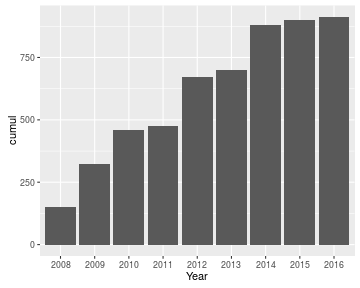
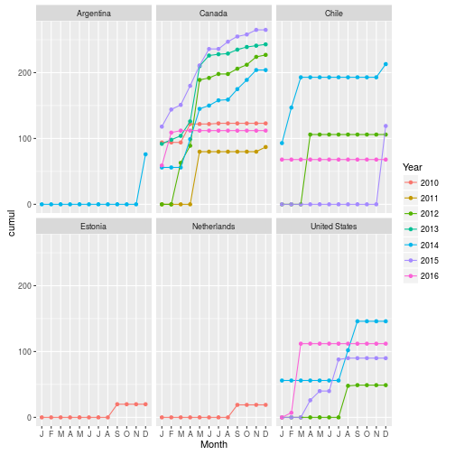
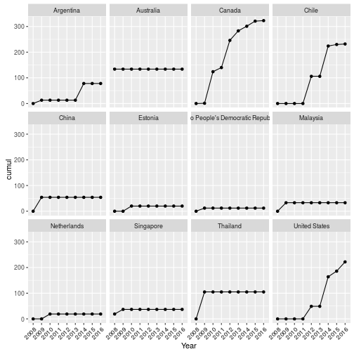
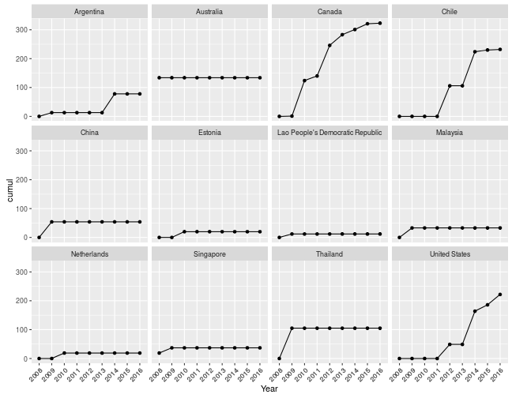

myebird 
=======

The `myebird` package provides functions that enable to quickly tally your own eBird dataset. You can slice it multiple ways to obtain total or cumulative species counts across countries, years, and even months. This is still a work in progress, so if you find any bugs or problems, please submit an [issue](https://github.com/sebpardo/myebird/issues).

## Downloading your personal eBird data

The first step is to submit a request to download your eBird data [here](http://ebird.org/ebird/downloadMyData) (make sure you are logged into eBird!). After a few minutes a you'll receive an email with a download link to a .zip file, which contains a csv file called "MyEBirdData.csv". Make sure to extract this file to your working directory in R.

## Installation

You can install this package from Github using devtools:


```r
#install.packages("devtools")
devtools::install_github("sebpardo/myebird")
```


## Usage

We first load myebird and other required packages used in this example.


```r
library(myebird)
library(dplyr)
library(ggplot2)
```

### Loading data to R

The file provided by eBird can be easily read into R using `read.csv`, however there are a few fields that need to be slightly moved around in order to be able to group the data as needed. For example, the country information is not separate from the Location field, dates are stored as character, and common and scientific names include subspecies. We therefore provide the function `ebirdclean` which reads and then "cleans" this data frame for easier analysis:


```r
mylist <- ebirdclean("MyEBirdData.csv") 
glimpse(mylist)
```

```
## Observations: 19,993
## Variables: 27
## $ Submission.ID          (chr) "S17534542", "S21246515", "S17182039", ...
## $ Common.Name            (chr) "Lesser Rhea (Puna)", "Lesser Rhea (Pun...
## $ Scientific.Name        (chr) "Rhea pennata tarapacensis/garleppi", "...
## $ Taxonomic.Order        (dbl) 14, 14, 154, 154, 212, 214, 214, 217, 2...
## $ Count                  (chr) "10", "1", "1", "1", "2", "20", "1", "1...
## $ State.Province         (chr) "CL-AN", "CL-AN", "CL-RM", "CL-CO", "AU...
## $ County                 (chr) "", "", "", "", "", "", "", "", "Albern...
## $ Location               (chr) "Camino a Laguna Miscanti", "Camino ent...
## $ Latitude               (dbl) -23.69723, -22.47137, -33.34951, -29.74...
## $ Longitude              (dbl) -67.81878, -68.03254, -70.32623, -71.14...
## $ Date                   (chr) "03-18-2014", "12-22-2014", "01-24-2014...
## $ Time                   (chr) "03:45 PM", "08:50 AM", "09:30 AM", "08...
## $ Protocol               (chr) "eBird - Casual Observation", "eBird - ...
## $ Duration..Min.         (int) 0, 0, 0, 120, 0, 285, 290, 285, 0, 35, ...
## $ All.Obs.Reported       (int) 1, 0, 1, 1, 1, 1, 1, 1, 0, 1, 1, 1, 1, ...
## $ Distance.Traveled..km. (dbl) NA, NA, NA, 1.500, NA, 2.400, 6.750, 2....
## $ Area.Covered..ha.      (dbl) NA, NA, NA, NA, NA, NA, NA, NA, NA, NA,...
## $ Number.of.Observers    (int) 1, NA, 2, 1, NA, 2, 2, 2, 87, 3, 3, 4, ...
## $ Breeding.Code          (chr) "FL {0}--Recently Fledged Young", "", "...
## $ Species.Comments       (chr) "", "", "Un ejemplar observado caminand...
## $ Checklist.Comments     (chr) "", "", "", "", "", "", "", "", "WildRe...
## $ Year                   (chr) "2014", "2014", "2014", "2014", "2008",...
## $ Month                  (fctr) March, December, January, March, Decem...
## $ Country.code           (chr) "CL", "CL", "CL", "CL", "AU", "AR", "AR...
## $ sciName                (chr) "Rhea pennata", "Rhea pennata", "Nothop...
## $ comName                (chr) "Lesser Rhea", "Lesser Rhea", "Chilean ...
## $ Country                (chr) "Chile", "Chile", "Chile", "Chile", "Au...
```

This function adds six new columns: Year, Month, Country.code, sciName, comName, and Country, which help . The year and month fields are extracted from the date, 

### Calculating cumulative and total species counts 

The two functions that do the tallying of total and cumulative counts are `myebirds` and `myebirdscumul`, respectively. They both work similarly: they have the argument "grouping", which specifies how to tally species counts.

Let's start with `myebirds`. If we want to see the **total** number of species seen each year, we specify this in the "grouping" argument:


```r
totyear  <- myebirds(mylist, grouping = "Year")
totyear
```

```
## Source: local data frame [9 x 2]
## 
##    Year     n
##   (chr) (int)
## 1  2008   152
## 2  2009   191
## 3  2010   151
## 4  2011    87
## 5  2012   330
## 6  2013   243
## 7  2014   472
## 8  2015   375
## 9  2016   228
```

To see these values graphically:


```r
ggplot(totyear, aes(Year, n)) + geom_bar(stat = "identity")
```



If we wanted to see our **cumulative** yearly counts, we use `ebirdscumul`. In this case, we use the argument "cum.across" to specify we want to calculate cumulative across "Year", we use `NULL` as our "grouping" since we are not grouping by anything:


```r
cumyear <- myebirdscumul(mylist, grouping = NULL, cum.across = "Year")
cumyear
```

```
##   location Year cumul
## 1    World 2008   152
## 2    World 2009   324
## 3    World 2010   459
## 4    World 2011   474
## 5    World 2012   671
## 6    World 2013   702
## 7    World 2014   882
## 8    World 2015   902
## 9    World 2016   913
```

```r
ggplot(cumyear, aes(Year, cumul)) + geom_bar(stat = "identity")
```


What I really wanted these function to do is to slice the data in more complex ways. For example, how many birds have I seen each month in each country? 


```r
myebirds(mylist, grouping = c("Country", "Month")) %>%
  ggplot(aes(ordered(Month, month.name), n)) + geom_bar(stat = "identity") +
  scale_x_discrete(name = "Month", labels = substring(month.abb, 1, 1)) +
  facet_wrap(~Country)
```



Or even cooler, how many species have I seen in each country and year, cumulative per month, between 2010 and 2016?


```r
myebirdscumul(mylist, grouping = c("Country", "Year"), year = 2010:2016,
                        cum.across = c("Month")) %>%
  ggplot(aes(ordered(Month, month.name), cumul, color = Year, group = Year)) +
  geom_point() + geom_line() +
  scale_x_discrete(name = "Month", labels = substring(month.abb, 1, 1)) +
  facet_wrap(~Country)
```



Or how many species have I recorded in every country, cumulative across years?


```r
myebirdscumul(mylist, grouping = "Country", cum.across = "Year") %>%
  ggplot(aes(Year, cumul, group = 1)) + geom_point() + geom_line() +
  theme(axis.text.x = element_text(angle = 45, hjust = 1)) +
  facet_wrap(~Country)
```



## Bugs/Problems?

This package is still a work in progress, so if you find any issues/bugs/problems please [let me know](https://github.com/sebpardo/myebird/issues). There are a few more features I'd like to add (e.g., functions that make the graphs, grouping by county, grouping by taxa, to name a few); ideas are welcome!
